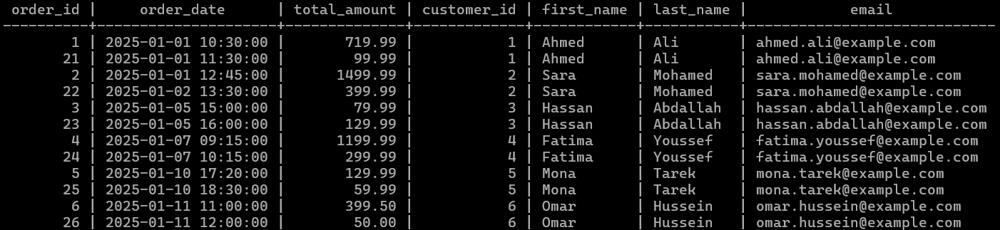

# E-Commerce Database Design

This repository contains the database schema and SQL scripts for an e-commerce platform, created as part of a mentorship tasks under Eng. Ahmed Emad. The task is based on concepts from the book "Practical Web Database Design".

## Table of Contents

1. [Database Schema](#database-schema)
2. [Entity Relationships](#entity-relationships)
3. [Entity Relationship Diagram (ERD)](#entity-relationship-diagram-erd)
4. [Sample Queries](#sample-queries)
   - [Daily Revenue Report](#daily-revenue-report)
   - [Monthly Top-Selling Products Report](#monthly-top-selling-products-report)
   - [High-Value Customers Report](#high-value-customers-report)
5. [Applying Denormalization to Customer and Order Entities](#applying-denormalization-to-customer-and-order-entities)

## Database Schema

### 1. `category`

```sql
CREATE TABLE category(
    category_id SERIAL PRIMARY KEY,
    category_name VARCHAR(50) NOT NULL UNIQUE
);
```

### 2. `product`

```sql
CREATE TABLE product(
    product_id SERIAL PRIMARY KEY,
    category_id INTEGER NOT NULL,
    name VARCHAR(50) NOT NULL,
    description TEXT,
    price NUMERIC(7,2) NOT NULL CHECK(price > 0),
    stock_quantity INTEGER NOT NULL DEFAULT 0,

    FOREIGN KEY(category_id) REFERENCES category
);
```

### 3. `customer`

```sql
CREATE TABLE customer(
    customer_id SERIAL PRIMARY KEY,
    first_name VARCHAR(50) NOT NULL,
    last_name VARCHAR(50) NOT NULL,
    email VARCHAR(255) NOT NULL UNIQUE,
    password VARCHAR(255) NOT NULL
);
```

### 4. `orders`

```sql
CREATE TABLE orders(
    order_id SERIAL PRIMARY KEY,
    customer_id INTEGER NOT NULL,
    order_date TIMESTAMP NOT NULL DEFAULT CURRENT_TIMESTAMP,
    total_amount NUMERIC(7,2) NOT NULL CHECK(total_amount > 0),

    FOREIGN KEY(customer_id) REFERENCES customer(customer_id)
);
```

### 5. `order_details`

```sql
CREATE TABLE order_details(
    order_details_id SERIAL PRIMARY KEY,
    order_id INTEGER NOT NULL,
    product_id INTEGER NOT NULL,
    quantity INTEGER NOT NULL CHECK (quantity > 0),
    unit_price NUMERIC(7,2) NOT NULL CHECK(unit_price > 0),

    FOREIGN KEY(order_id) REFERENCES orders(order_id),
    FOREIGN KEY(product_id) REFERENCES product(product_id)
);
```

## Entity Relationships

### 1. `product` and `category` (One-to-Many)

- Each product belongs to a category.
- Each category can contain one or more products.

  

### 2. `product` and `order` (Many-to-Many)

- Each product can be ordered by zero, one, or more orders.
- Each order can be order for one or more products.
- The `order_details` table will act as an associative entity to resolve this relationship.

  

### 3. `customer` and `order` (One-to-Many)

- Each customer can place zero, one, or more orders.
- Each order is placed by exactly one customer.

  

## Entity Relationship Diagram (ERD)


## Sample Queries

### Daily Revenue Report

Generates a report of the total revenue for a specific date.

```sql
SELECT
    DATE(order_date) AS ORDER_DATE,
    SUM(total_amount) AS DAILY_REVENUE
FROM
    orders
WHERE
    DATE(order_date) = '2025-01-01'
GROUP BY
    DATE(order_date);
```


### Monthly Top-Selling Products Report

Generates a report of the top-selling products in a given month.

```sql
SELECT
    p.product_id,
    p.name,
    SUM(od.quantity) AS total_sold
FROM
    product AS p
    JOIN order_details AS od ON p.product_id = od.product_id
    JOIN orders AS o ON od.order_id = o.order_id
WHERE
    o.order_date BETWEEN '2025-01-01' AND '2025-01-31'
GROUP BY
    p.product_id, p.name
ORDER BY
    total_sold DESC
LIMIT 5;
```


### High-Value Customers Report

Retrieves a list of customers who have placed orders totaling more than $500 in the past month.

```sql
SELECT
    c.customer_id,
    (c.first_name || ' ' || c.last_name) AS full_name,
    SUM(o.total_amount) AS total_spent
FROM
    customer AS c
    JOIN orders AS o ON c.customer_id = o.customer_id
WHERE
    o.order_date >= DATE '2025-04-01' - INTERVAL '1 month'
    AND o.order_date < DATE '2025-04-01'
GROUP BY
    c.customer_id, full_name
HAVING
    SUM(o.total_amount) > 500
ORDER BY
    total_spent DESC;
```


## Applying Denormalization to Customer and Order Entities

Denormalization is a technique used to improve read performance by reducing the number of joins required in queries. In this case, we can apply denormalization to the customer and order entities by creating a separate table (`order_history`) that pre-computes the result of joining these tables.

```sql
CREATE TABLE order_history (
    order_id INTEGER NOT NULL,
    order_date TIMESTAMP NOT NULL,
    total_amount NUMERIC(7,2) CHECK(total_amount > 0),

    customer_id INTEGER NOT NULL,
    first_name VARCHAR(50) NOT NULL,
    last_name VARCHAR(50) NOT NULL,
    email VARCHAR(255) NOT NULL,

    FOREIGN KEY (order_id) REFERENCES orders(order_id),
    FOREIGN KEY (customer_id) REFERENCES customer(customer_id),

    PRIMARY KEY (order_id)
);


INSERT INTO order_history (order_id, order_date, total_amount,
                           customer_id, first_name, last_name, email)
SELECT
    o.order_id,
    o.order_date,
    o.total_amount,
    c.customer_id,
    c.first_name,
    c.last_name,
    c.email
FROM
    orders AS o
    JOIN customer AS c ON c.customer_id = o.customer_id;

```


